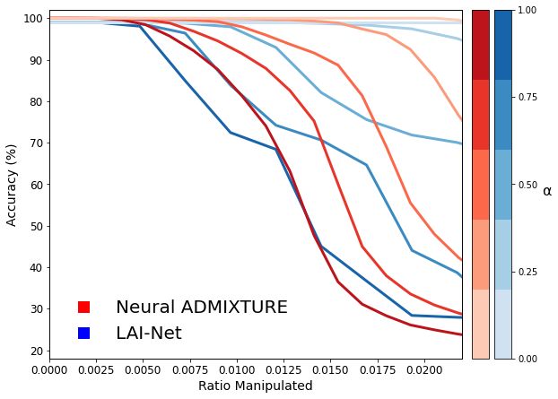
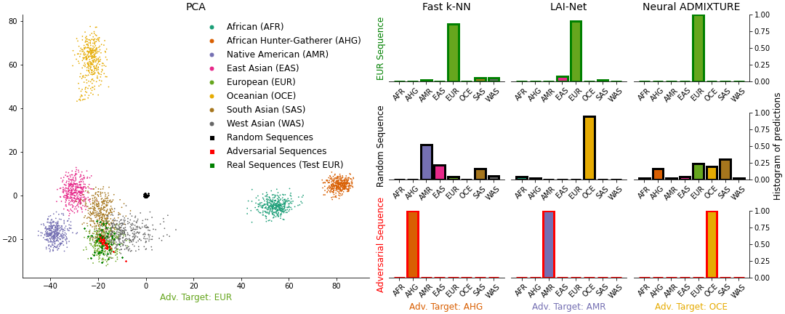

# Adversarial Attacks On Genotype Sequences

Code for ''Adversarial Attacks On Genotype Sequences'' Paper


## Notice
The code is "as is" and will not be actively supported or updated. 


## Preliminaries
Follow notebook (A) to train LAI-Net and Neural ADMIXTURE.


## Adversarial Robustness Analysis
Follow notebook (B) to perform an adversarial robustness analysis to LAI-Net and Neural ADMIXTURE.


## Adversarial Dataset Generation
Follow notebook (C) to generate a targeted adversarial dataset to fool PCA, k-NN, LAI-Net and Neural ADMIXTURE.


## Adversarial Attack Detection
Follow notebook (D) to evaluate the manipualtions from notebook B and C


## License

**NOTICE**: This software is available free of charge for academic research use only. Commercial users, for profit companies or consultants, and non-profit institutions not qualifying as "academic research" must contact the [Stanford Office of Technology Licensing](https://otl.stanford.edu/) for a separate license. This applies to this repository directly and any other repository that includes source, executables, or git commands that pull/clone this repository as part of its function. Such repositories, whether ours or others, must include this notice. Academic users may fork this repository and modify and improve to suit their research needs, but also inherit these terms and must include a licensing notice to that effect.

## Cite

#### When using this software, cite: 
Montserrat, Daniel Mas, and Alexander G. Ioannidis. "Adversarial Attacks on Genotype Sequences." Biorxiv.

https://www.biorxiv.org/content/10.1101/2022.11.07.515527v1

```
@inproceedings{montserrat2020lai,
  title={Adversarial Attacks on Genotype Sequences},
  author={Montserrat, Daniel Mas and Ioannidis, Alexander},
  booktitle={biorxiv},
}
```
